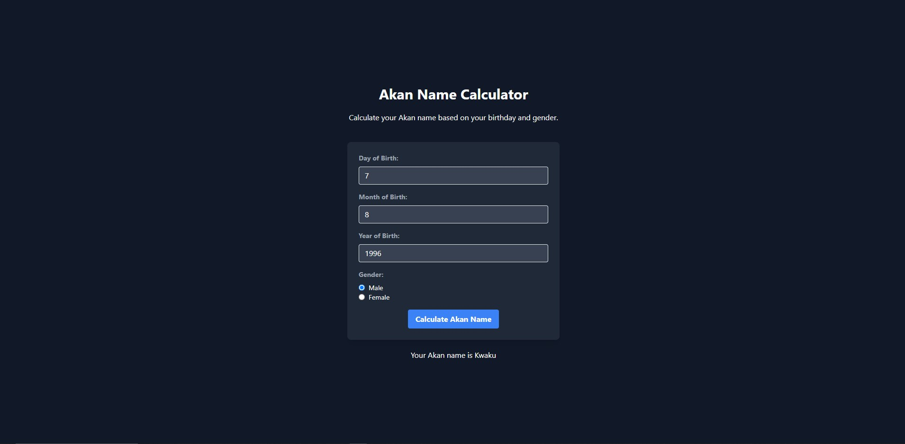

# Akan Name Generator
The Akan Name Calculator is a simple web application that calculates your Akan name based on your birthday and gender. Akan names are traditional names used by the Akan people in Ghana and the Ivory Coast. These names are often associated with the day of the week on which an individual is born.

# Features
* Input your day, month, and year of birth.
* Select your gender (male or female).
* Click the "Calculate Akan Name" button to get your Akan name.

# Getting Started
Follow these steps to get the project up and running on your local machine:

1. Clone the repository
   git clone https://github.com/your-username/akan-name-calculator.git
2. Navigate to the project directory
   cd akan-name-calculator
3. Open the `index.html` file.

 # Usage
1. Enter your day, month, and year of birth in the respective input fields.
2. Select your gender by clicking on the radio button (Male or Female).
3. Click the "Calculate Akan Name" button.
4. Your Akan name will be displayed on the screen.

# Technologies Used
* HTML
* CSS (with Tailwind CSS for styling)
* JavaScript
# Contributing

Contributions are welcome! If you'd like to contribute to the project, please follow these guidelines:

1. Fork the repository.
2. Create a new branch for your feature or bug fix.
3. Make your changes and commit them.
4. Push your changes to your fork.
5. Submit a pull request to the main repository.

# License
This project is licensed under the MIT License - see the LICENSE file for details.

# Acknowledgments

This project was inspired by the rich culture and traditions of the Akan people in Ghana and the Ivory Coast.

# Contact

If you have any questions or suggestions, please feel free to contact the project maintainers:

James Odera - james.nyangoma4@gmail.com
